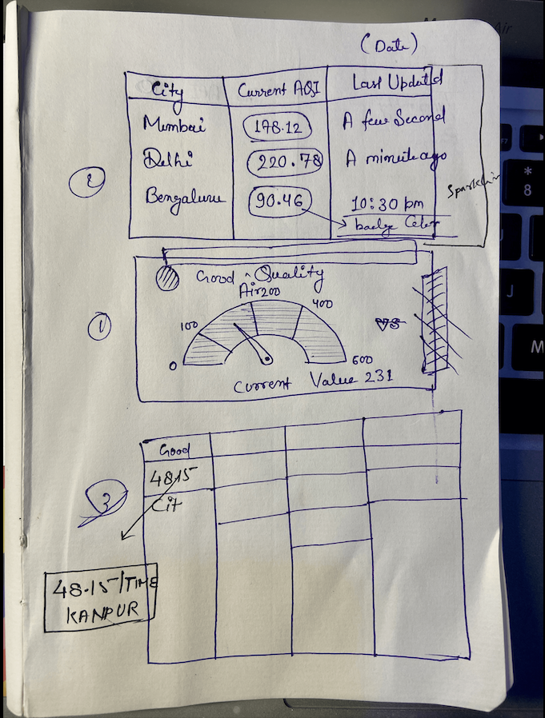
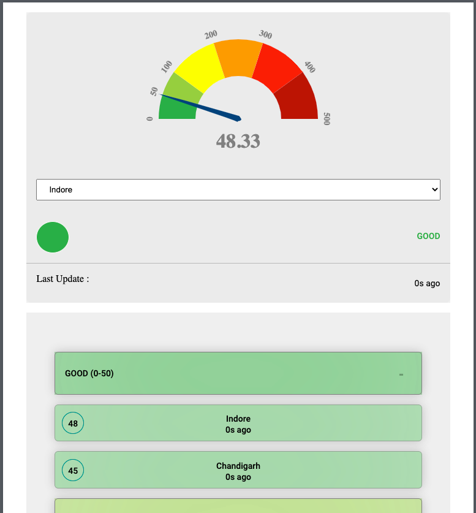
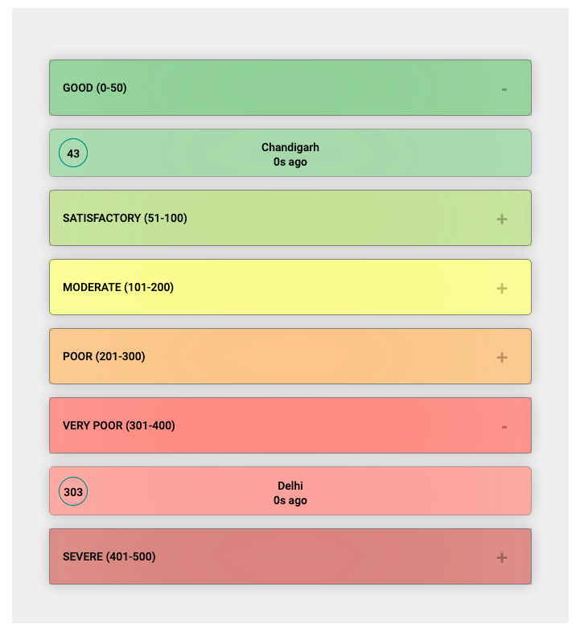
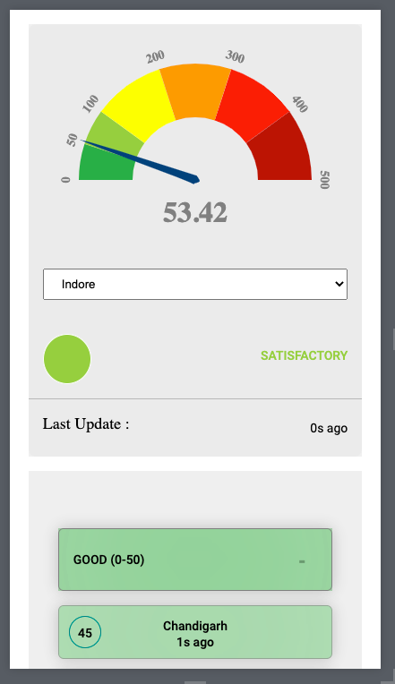
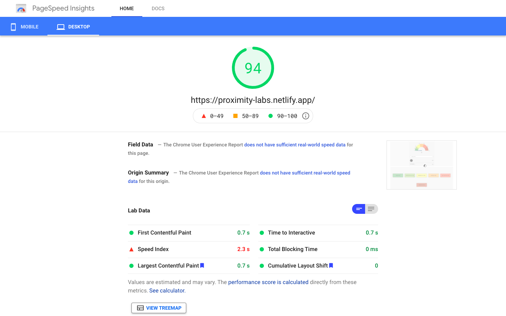

# Air Quality Monitoring Application - Proximity Labs

## Demo Link

Open Here -

[ **Demo Netlify** ](https://proximity-labs.netlify.app/)
 

## Problem Statement

### Instructions:

### Deliverables:

- [x] 1. Hosting URL on Netlify pages : [ **Live Application** ](https://proximity-labs.netlify.app/)
- [x] 2. Github repo link to your solution : [ **Github** ](https://github.com/dipanshuraz/octo-sniffle)
- [x] 3. Time taken to complete this : around 8 hours

### Tech / Stack:

- HTML5
- CSS3
- JavaScript
- React
- Sass

### Library Used:

- [react-d3-speedometer](https://www.npmjs.com/package/react-d3-speedometer)
- [react-sparklines](http://borisyankov.github.io/react-sparklines/)

## Mock-up UI :

 

## Deployed UI :

 

 

 

### Mobile & Tab

 

 

 

### Performance

 

This project was bootstrapped with [Create React App](https://github.com/facebook/create-react-app).

## Available Scripts

In the project directory, you can run:

### `npm install`

### `npm start`

Runs the app in the development mode. 
Open [http://localhost:3000](http://localhost:3000) to view it in the browser.

The page will reload if you make edits. 
You will also see any lint errors in the console.
